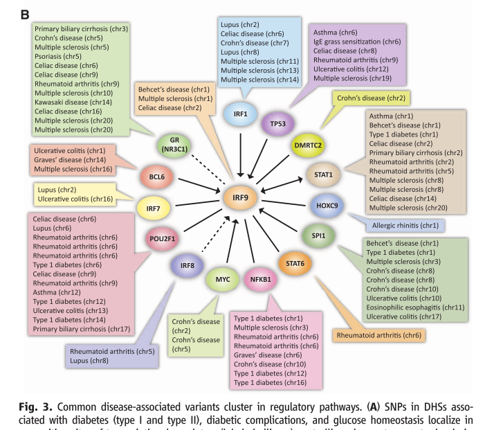

```{r setup,echo=FALSE,results="hide"}
suppressPackageStartupMessages({
suppressMessages({
library(TFutils)
library(gwascat)
})
})
```

# Introduction

TFutils addresses very general problems of annotation and location
of TFs and their targets.

# TF involvement in GWAS findings

The following illustrates aspects of combinatorics of TFs in
conjunction with GWAS findings for a collection of diseases (@Maurano2012).



## Looking for genes association with POU2F1 in GO

Let's consider how to identify the genes in the POU2F1 pathway and check 
for GWAS hits.  According to GeneCards, the POU2F1 TF is involved with the
glucocorticoid receptor network and the ATF-2 TF network.

Let's try GO.

```{r lkgo}
library(GO.db)
allt = keys(GO.db, keytype="TERM")
grep("glucocorticoid", allt, value=TRUE)
select(GO.db, keys="glucocorticoid receptor signaling pathway", 
  columns=c("GOID", "SYMBOL"), keytype="TERM")
```

Then check in ebicat

```{r dogwas}
library(gwascat)
data(ebicat37)
ebicat37
```

## Using MSigDb

```{r dogse}
library(GSEABase)
getGmt(system.file("msigdb_extracts/POU1F1_Q6.gmt", package="TFutils")) -> poum
poum[[1]] -> p1
library(org.Hs.eg.db)
geneIdType(p1) = SymbolIdentifier()
p2 = p1
geneIdType(p2) = EntrezIdentifier("org.Hs.eg.db")
```
search the gwascatalog for hits in these genes

Let's say that MsigDb is our preferred map from TFs to gene sets (as TF targets)

Should we make a database that links from familiar symbols like VDR to targets of VDR
or from ORMDL3 to any TF that happens to bind near it....

MSigDb has a RESTful interfaces?  tft gmt has been acquired

canonical HGNC names for TFs derived from tfname (remove suffix for example) and bridge
to the M numbers used in FIMO

compare the FIMO binding profile for a TF to the genes called 'targets'

binding profiles are in bed files -> granges on some chromosome
also:  genes(TxDb.Hsapiens.UCSC.hg19.knownGene) -> a granges ... do the places of high binding
coincide with the promoter regions or any regions of the genes called 'targets'


# References
